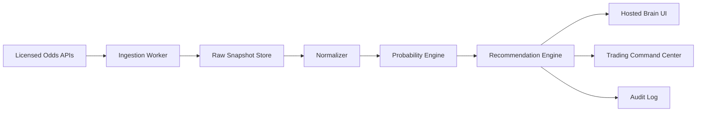

# Architecture

## Purpose

Bet365 Edge Brain is the independent logic layer for odds comparison and value detection. The trading command center should eventually consume its outputs through a stable recommendation contract instead of duplicating betting math inside the command-center UI.

## Layers

1. Data ingestion
   - Pull odds from licensed providers.
   - Normalize bookmaker names, markets, teams, odds formats, timestamps, and settlement rules.
   - Store immutable raw snapshots before transformation.

2. Normalization
   - Convert all prices to decimal odds.
   - Group equivalent markets and outcomes.
   - Reconcile naming differences across books.
   - Mark stale, incomplete, suspended, or low-liquidity quotes.

3. Probability model
   - Start with no-vig market consensus.
   - Add domain models later: Elo, player injuries, weather, schedule fatigue, team form, closing-line movement, exchange liquidity, and sport-specific features.
   - Calibrate every model against historical outcomes.

4. Recommendation engine
   - Compare Bet365 odds to model probability.
   - Calculate expected value.
   - Calculate fractional Kelly stake with hard bankroll caps.
   - Score risk and data quality.
   - Emit transparent recommendation objects.

5. Audit and feedback
   - Log every recommendation with source snapshot IDs.
   - Track whether the bet was accepted, rejected, placed, voided, won, or lost.
   - Compare recommendation price against closing line value.

6. Command center integration
   - Consume recommendation JSON.
   - Display signal status, risk, confidence, and reason codes.
   - Keep execution approval separate from signal generation.

## First Production Shape

## Recommended Hosting Split

- Cloudflare Pages: static UI and docs.
- Cloudflare Workers: provider API calls and secret handling.
- D1, Postgres, or durable object backed storage: snapshots, recommendations, and audit logs.
- GitHub: source of truth for code and docs.

## Why The Browser Is Not Enough

The browser version can demonstrate logic and handle pasted sample data. Production data must move through a backend because provider API keys must stay secret, data needs persistence, and historical calibration requires a database.

